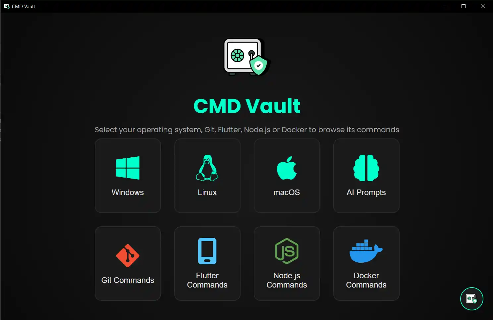
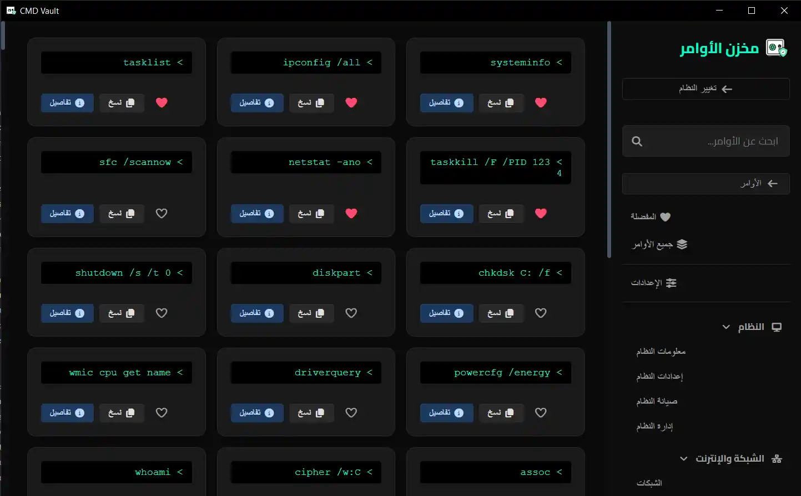
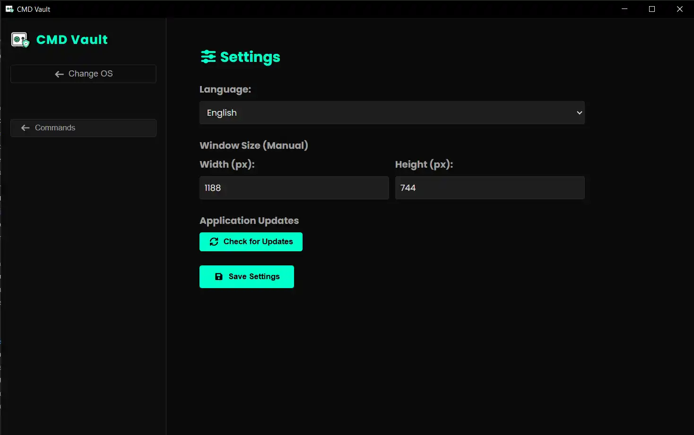
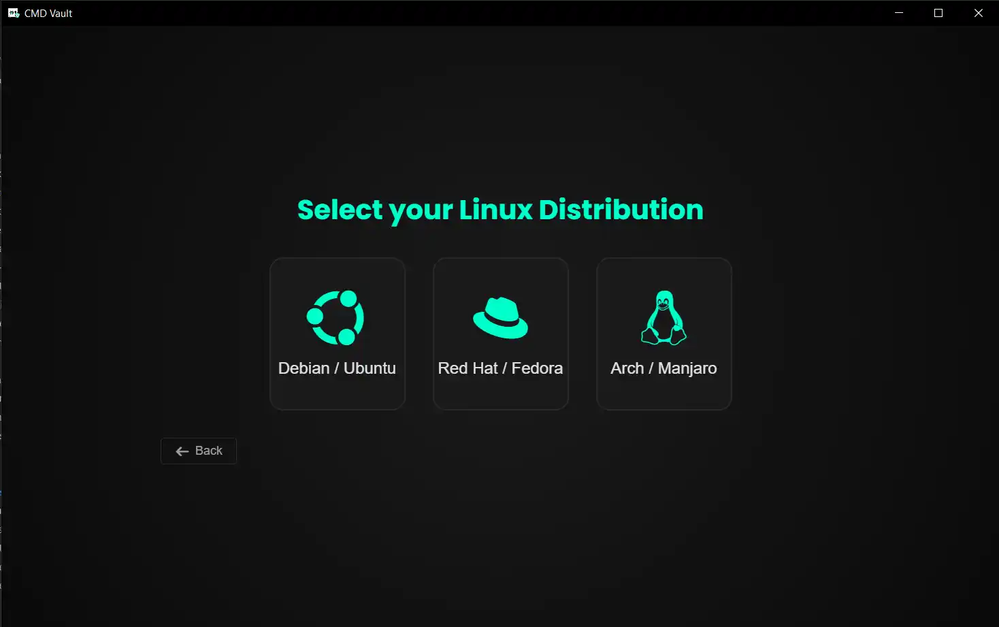

<div align="center">

# CMD Vault

[](https://www.electronjs.org/)
[](https://github.com/AliAl-ojeely)
[](LICENSE)
[](https://github.com/AliAl-ojeely)
[](https://github.com/AliAl-ojeely)

</div>

## What is CMD Vault?

<div align="center">

</div>

<br>

CMD Vault is a **fully offline, bilingual** command reference application for **Windows**, **Linux**, and **macOS**. It provides a categorized, instantly searchable library of essential terminal commands, each accompanied by a detailed explanation in **English and Arabic**.  

Built with Electron.js, the app requires no internet connection, respects your privacy, and is perfect for isolated servers, secure environments, or anyone tired of searching the web for command syntax.

> **Important:** CMD Vault is a **reference tool** – it displays commands, lets you copy them, and explains their purpose. It does **not** execute any command on your system.

---

## Features

- **Bilingual First** – Full Arabic & English UI and command descriptions.  
- **100% Offline** – No ads, no tracking, no analytics. Works in air‑gapped environments.  
- **Multi‑OS Support** – Dedicated command sets for Windows, Linux, and macOS.  
- **Linux Distro Selector** – Choose Debian/Ubuntu, Red Hat/Fedora, or Arch/Manjaro to see relevant commands.  
- **Instant Search & Categories** – Filter by keyword or browse by category (System Info, Networking, File Management, etc.).  
- **One‑Click Copy** – Copy any command to your clipboard with a single click.  
- **Detailed Descriptions** – Each command includes a comprehensive “what it does” and “when to use it” in both languages.  
- **Persistent Settings** – Language and window size preferences are saved automatically.  
- **OLED Dark Theme** – High‑contrast, dark interface designed for terminals and night work.  
- **Developer Info Modal** – Quick access to project credits and version information.  
- **Portable & Lightweight** – No heavy database engine; all command data lives in simple JavaScript files.  
- **Cross‑Platform Builds** – Pre‑built installers for Windows, macOS, and Linux are available.  

<br>
<div align="center">

</div>
<br>

---

## Installation

### Pre‑built releases

Download the latest installer for your operating system from the [Releases](https://github.com/AliAl-ojeely/CMD-Vault/releases) page:

- **Windows** – `.exe` NSIS installer (x64 / ARM64)  
- **macOS** – `.dmg` universal binary (Intel + Apple Silicon)  
- **Linux** – `.AppImage` (x64 / ARM64)  

### Run from source (development)

```bash
git clone https://github.com/AliAl-ojeely/CMD-Vault.git
cd CMD-Vault
npm install
npm start
```

<br>
<div align="center">

</div>
<br>

Requirements: Node.js 22+ and npm.

Build from source
To create distributable installers locally:

```bash
npm run dist          # Build for the current OS
npm run dist-win      # Windows only
npm run dist-linux    # Linux only
The outputs will appear in the dist/ folder.
```

---

## Project Structure

```bahs
CMD-Vault/
├── .github/
│   └── workflows/
│       └── release.yml          # GitHub Actions – automatic releases
├── assets/
│   ├── fonts/                   # Cairo, Poppins (supports Arabic)
│   ├── fontawesome/             # Icons
│   ├── icon.ico
│   ├── icon.png
│   ├── 1.webp
│   ├── 2.webp
│   ├── 3.webp
│   ├── 4.webp
│   └── icon.icns
├── css/
│   ├── main.css                 # Entry point, imports all other CSS
│   ├── variables.css            # OLED dark theme variables
│   ├── component-layout.css     # Cards, buttons, animations
│   └── modals.css               # Modals and overlays
├── data/
│   ├── win-commands.js          # Windows commands
│   ├── linux-commands.js        # Linux commands
│   ├── mac-commands.js          # Mac commands
│   ├── docker-commands.js       # Docker commands
│   ├── ai-prompts.js            # AI Prompts
│   ├── git-commands.js          # Git commands
│   ├── flutter-commands.js      # Flutter commands
│   ├── nodejs-commands.js       # Node.js & NPM commands
│   └── commands-grouping.js     # Utility: merges the above into commands.json
├── modules/
│   ├── database.js              # Loads commands from the .js files
│   ├── distro-detector.js       # Detects Linux distribution family
│   └── updater.js               # Checks for new GitHub releases
├── render/
│   ├── state.js                 # Centralised renderer state
│   ├── ui.js                    # DOM helpers, language switching, modal logic
│   ├── search.js                # Search & filter logic
│   ├── command-card.js          # Creates individual command cards
│   ├── render-main.js           # Main renderer orchestrator
│   └── shortcuts.js             # Keyboard shortcuts for the main app 
├── src/
│   ├── main.js                  # Electron main process, IPC handlers
│   ├── preload.js               # Context bridge (secure API exposure)
│   └── translations.js          # Full Arabic & English dictionary
├── index.html                   # Single-page application shell
├── package.json                 # Dependencies, scripts, build configuration
├── README.md                    
└── .gitignore
```

---

## Usage

Launch the app.

On the landing page, choose your operating system (Windows or Linux).

If you pick Linux, a second screen lets you select your distribution family.

Browse commands in the left sidebar by category, or use the search bar.

Click Copy to copy a command, or Details to read a full description.

Access Settings from the sidebar to change the language or adjust the window size.

<br>
<div align="center">

</div>
<br>

---

## Contributing

Contributions are welcome!

You can help by:

Adding new commands to the data/ files (follow the existing format).

Improving translations or descriptions.

Reporting bugs or suggesting features via Issues.

Please fork the repository and create a pull request with your changes.

## Developer & Contact

**Ali Nasser Al-ojeely (Mr.Ghost)** *Junior Software Developer | Frontend Specialist*

[](https://github.com/AliAl-ojeely)
[](mailto:alialojeely@gmail.com)

If you have any suggestions, encounter bugs, or want to contribute, feel free to open an issue or reach out directly!